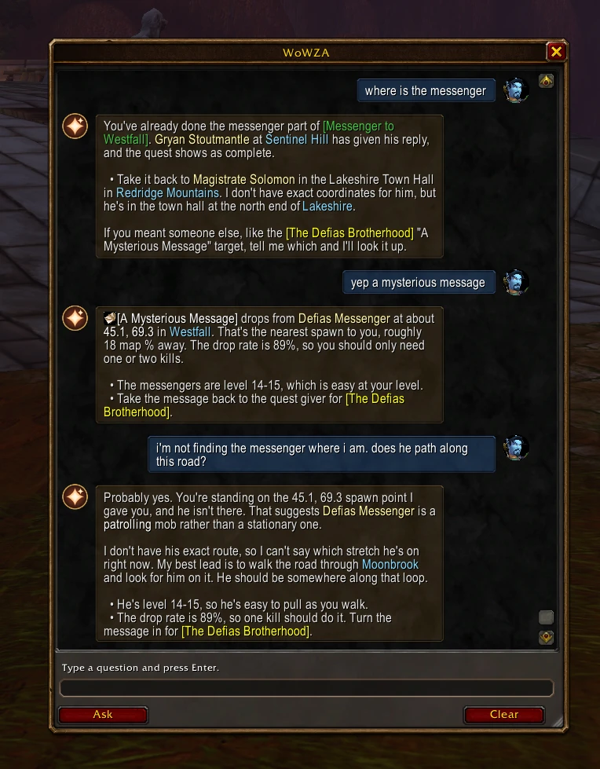

# WoWZA: World of Warcraft Zone Advisor



An in-game AI advisor for **WoW Forever**. Ask about your quests, zone, class, talents, rotation or
leveling in a chat window inside WoW, and get answers that know your character and the real game data:

- **Knows your character.** Every question carries your level, class, talents (points per tree),
  profession and weapon skills, gear, gold, zone, map coordinates and quest log with objectives.
- **Grounded in game data.** With [QuestieDB](https://github.com/Questie/QuestieDB)'s Forever data, the
  companion looks up the quests, items, NPCs and objects you name (and roles like "first aid trainer"
  or "flight master") and hands the AI real facts: quest givers, drop rates, vendors, mob levels, rare
  spawns, and spawn coordinates with the spot nearest you. Only NPCs friendly to your faction are suggested.
- **Reads like a chat.** Your questions sit on the right next to your portrait, answers on the left next to
  the WoWZA icon. Items, quests and spells in answers are real links with icons and quality colors: hover
  for the tooltip, shift-click to link them in chat.
- **No reloads.** Ask with Enter and Ctrl+C; the answer appears by itself a few seconds later, with the
  whisper sound.
- **Your choice of AI.** Your Claude Pro/Max subscription (default), the Claude API, Google Gemini's free
  tier, a local model through Ollama, or any OpenAI-compatible service.

WoWZA has two parts: the **addon** (the window in WoW) and the **companion app** (runs on your PC and talks
to the AI, since WoW addons can't use the network). Windows only.

## Install

1. Run **WoWZA.exe** (friends: that one file is all you need; see [Sharing](#sharing)).
   Settings opens on first run.
2. Check the **WoW game folder** (it's auto-detected, e.g. `...\World of Warcraft\_classic_beta_`) and click
   **Install / update addon**.
3. Accept the one-time **quest data** download (about 7 MB from QuestieDB's GitHub). You can also do it later
   in Settings.
4. Pick an **AI provider**, follow the steps shown under it, and click **Test connection**:

   | Provider | Cost | What you need |
   |---|---|---|
   | Claude subscription (default) | Included in Claude Pro or Max | Claude Code, or the Claude desktop app with its Code tab, signed in. Not available on the free plan. |
   | Claude API | About 1-3¢ per question | An Anthropic API key with credit |
   | Google Gemini | Free, with daily limits | A free Google AI Studio key (free-tier prompts may be used by Google) |
   | Local (Ollama) | Free, private | A decent GPU; less WoW knowledge than the cloud options |
   | Other (OpenAI-compatible) | Varies | OpenRouter, Groq, LM Studio, etc. |

5. **Fully restart WoW** (a `/reload` isn't enough the first time: the game only finds new addon files when
   it starts).

The companion has to be running for answers to arrive. Settings can add a desktop shortcut and start it
with Windows. It refuses to start twice, so you can't end up with two copies answering.

## Using it

1. Click the **WoWZA minimap button**, type `/za` (or `/wowza`), use the addon menu, or set a key binding
   (Options → Keybindings → AddOns → WoWZA).
2. Type a question and press **Enter**. The box fills with a code that's already selected.
3. Press **Ctrl+C**. A "WoWZA is thinking..." bubble appears once the companion has it.
4. The answer replaces it on its own, usually within 5-15 seconds. If the window is closed, a chat line
   tells you the answer is ready.

You can also ask straight from chat: `/za where do I find Crisp Spider Meat?`, or type into the companion
window on your PC. Questions that work well:

- *where is Hilary's necklace* · *how do I get the Cask of Merlot* · *where are the spiders for Redridge Goulash*
- *where is the first aid trainer* · *where's my class trainer* · *nearest flight master*
- *what talents should I take next* · *what's a good leveling rotation for me* · *is this zone right for my level*

### The window

- **Move** it by dragging the title and **resize** it from the bottom-right corner; it remembers both.
- Like the world map, it **fades while you move**, but stays solid while your mouse is over it or you're
  typing. **Clear** empties the conversation.
- The minimap button can be dragged around the edge; right-click hides it.

### Commands

| Command | What it does |
|---|---|
| `/za` or `/wowza` | Open or close the window |
| `/za <question>` | Ask straight from chat |
| `/za status` | Check automatic answer delivery (slots installed, slots left, signals) |
| `/za fade 70` | Window opacity while moving, 10-100 (100 = no fade, default 50) |
| `/za reset` | Default window size and position |
| `/za minimap` | Show or hide the minimap button |

## How it works

WoW addons can't use the network or open files while the game runs, so WoWZA uses the two doors that are left:

- **Out, the clipboard.** Your Ctrl+C copies the question and your character snapshot, the same mechanism
  WeakAuras and Plater use for import strings. The companion watches the clipboard and picks it up at once.
- **In, files the game reads on first use.** WoW reads a file from disk the first time it's used, as long
  as the file existed when the game started. The companion creates 100 small load-on-demand "answer slot"
  addons (`WoWZA_S001`-`S100`, listed in your AddOns; leave them enabled), writes each answer into them,
  and the addon loads a fresh one. To know when, it checks small sound files the companion fills in when
  your question arrives and when the answer is ready. That's why WoW needs a full restart after install,
  and why a session holds 100 answers before a `/reload` frees the slots.

On the companion side, each question is matched against the quest data, and the facts go to the AI along
with your character snapshot and the last few questions and answers.

Nothing reads the game's memory or screen, and nothing presses keys for you. The slot technique was measured
on the Forever client by [wow-ai](https://github.com/chelinho139/wow-ai).

## Troubleshooting

- **"The companion app hasn't picked up your question"**: start the companion (desktop shortcut or
  WoWZA.exe), then ask again.
- **"Claude Code isn't installed"**: install it with `irm https://claude.ai/install.ps1 | iex` and run
  `claude auth login`, or sign in to the Claude desktop app's Code tab. The companion also finds the copy
  inside the Microsoft Store version of the Claude app.
- **`/za status` says slots aren't installed**: click **Install / update addon** in Settings and fully
  restart WoW. Until then, answers still work by pressing **Ctrl+V** in the question box.
- **`/za status` says signals: no**: answers still arrive, just a few seconds later, timed around how long
  answers usually take.
- **"Answer slots are used up"**: `/reload` frees them (each session holds 100 answers).
- **The addon shows as out of date**: the `.toc` uses `## Interface: 16001` (client 1.60.1). Run
  `/dump (select(4, GetBuildInfo()))` in game and put that number in `WoWZA/WoWZA.toc`, or tick
  "Load out of date AddOns" on the AddOns screen.
- **Windows says "Windows protected your PC"** when starting WoWZA.exe: it's unsigned. Click
  **More info → Run anyway**.

## Your data

Settings, API keys, the companion's conversation history and the quest data live only on your PC, in
`%APPDATA%\WoWZA`. The addon keeps your in-game history and window layout in WoW's saved variables.
Nothing secret is in this repository or in WoWZA.exe, so both are safe to share.

## Sharing

Build the single-file app with `companion\build.ps1`: it creates `companion\dist\WoWZA.exe` (about 21 MB)
with the addon and icon inside. Friends need only that file, not Python. Send it directly (the exe isn't
committed to this repository). Each person signs in to their own AI provider and downloads the quest data
on their own PC; QuestieDB publishes no license file, so its data isn't bundled.

## Upgrading from Claude Advisor

WoWZA used to be called Claude Advisor (`/claude`). The first time the new companion starts, it moves its
settings, history and quest data to `%APPDATA%\WoWZA`, replaces the old shortcuts, swaps the `ClaudeAdvisor`
addon and its answer slots for `WoWZA` ones (your in-game history and window layout come along), and asks
you to fully restart WoW. A key binding set for the old name needs setting again.

## Development

Requires Python 3.10+ on Windows.

```bash
cd companion
pip install -r requirements.txt
python app.py
```

| Path | What it is |
|---|---|
| `WoWZA/Core.lua` | Window, character context, minimap button, commands |
| `WoWZA/Chat.lua` | The chat-bubble conversation view |
| `WoWZA/Format.lua` | Answer formatting: verified item/quest/spell links, colors, bullets |
| `WoWZA/Transport.lua` | Answer slots and signals |
| `WoWZA/Protocol.lua` | Clipboard message format |
| `companion/app.py` | Companion window, settings, clipboard watcher |
| `companion/bridge.py` | Addon install and migration, slot files, the AI's instructions |
| `companion/providers.py` | Claude (subscription and API), Gemini, Ollama, OpenAI-compatible |
| `companion/questdata.py` | QuestieDB download, index and question lookups |
| `tools/test_addon.py` | Runs the addon against a mock WoW API, end to end (needs `lupa`) |
| `tools/test_questdata.py` | Checks quest-data lookups against known Forever facts (needs the data) |
| `tools/make_icon.py` | Regenerates the addon icon and the app icon |

After changing the addon, click **Install / update addon** (or run `bridge.install_addon`) and `/reload`;
a new file needs a full WoW restart.

## Credits

- [wow-ai](https://github.com/chelinho139/wow-ai) for measuring the Forever client's file-loading rules and
  the slot and signal technique.
- [Questie](https://github.com/Questie/Questie) and [QuestieDB](https://github.com/Questie/QuestieDB) for
  the quest, NPC, item, object and drop data.
- [Gethe/wow-ui-source](https://github.com/Gethe/wow-ui-source) (`forever` branch) for checking the game's
  API.
